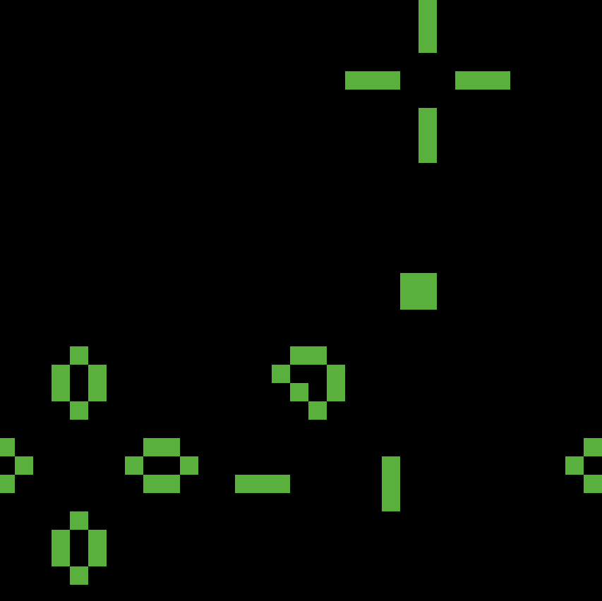
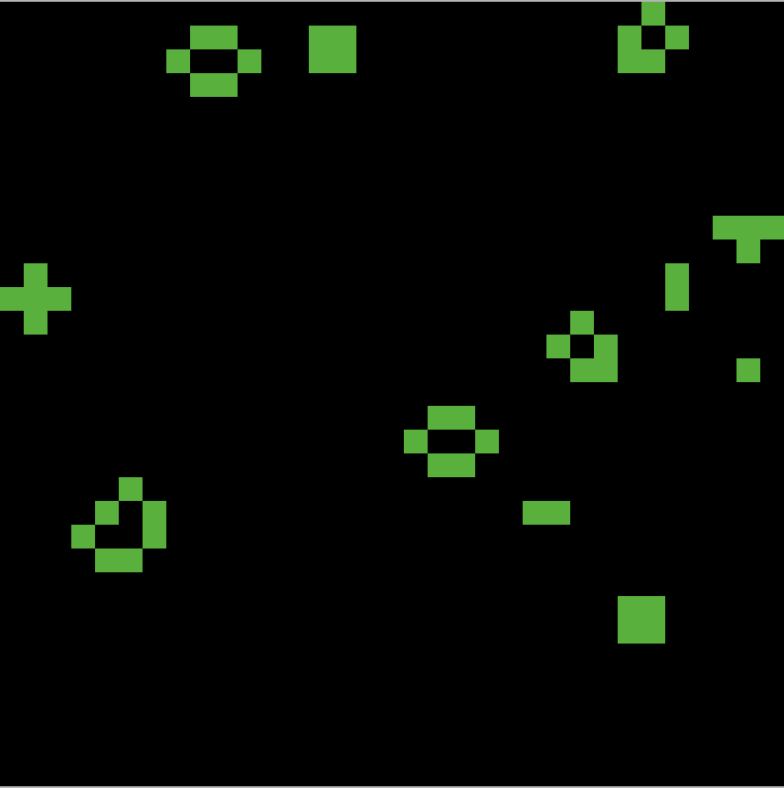

<h3 align="center">
  
</h3>

# Game of Life

NetLogo implemetation of [John Horton Conway](https://en.wikipedia.org/wiki/John_Horton_Conway)'s [Game Of Life](https://en.wikipedia.org/wiki/Conway%27s_Game_of_Life).

## Rules

The universe of the Game of Life is an infinite, two-dimensional orthogonal grid of square cells, each of which is in one of two possible states, alive or dead, (or populated and unpopulated, respectively). Every cell interacts with its eight neighbours, which are the cells that are horizontally, vertically, or diagonally adjacent. At each step in time, the following transitions occur:

	Any live cell with fewer than two live neighbours dies, as if by underpopulation.
	Any live cell with two or three live neighbours lives on to the next generation.
	Any live cell with more than three live neighbours dies, as if by overpopulation.
	Any dead cell with exactly three live neighbours becomes a live cell, as if by reproduction.
	
## Examples

